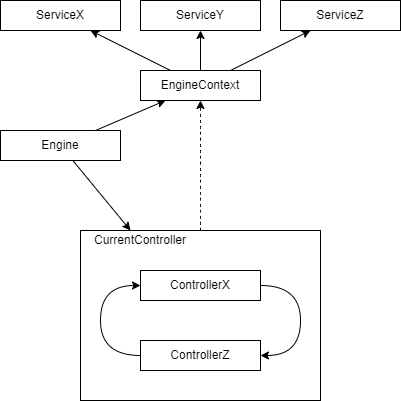

# Overview

The Engine manages the state of the current Controller and provides the EngineContext containing the needed functionality.
Additionally, the engine also invokes the lifetime events and makes sure to dispose and initialise the controller.
Multiple Controllers can be made to contain the logic of the game and can be thought of as Scenes.

How to structure the startup of your code and how to initialise the Engine can be found under "startup.md".

The core package is self contained and includes generic Engine Parts and doesn't reference anything outside of its package.
An overview over all the core Modules can be read up on using the "coreOverview.md" file.
Also special is the "Examples" package which containes main methods with minimal runnable examples of certain classes.
